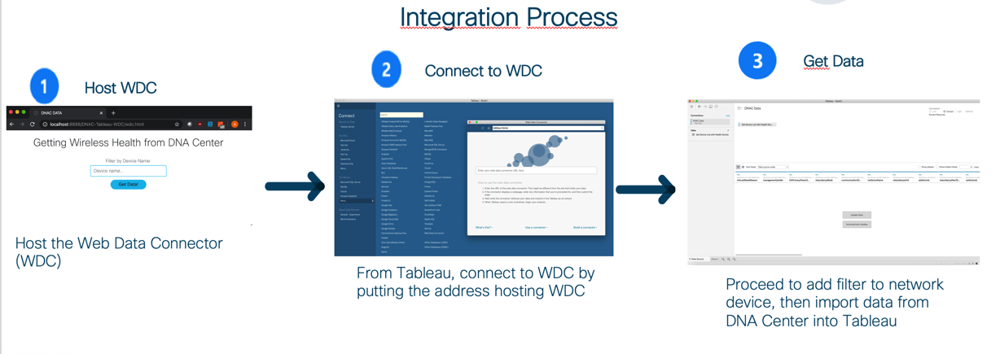
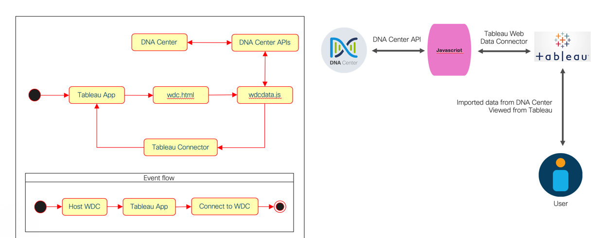

# DNAC integration with Tableau

A web data connector (WDC) to make use of DNAC API calls to get wireless health data and orchestrate into data reporting tool Tableau.

---

The "wdc.html" file will be the landing web page allowing user input. The input data will determine which devices' wireless health data to be retrieved in DNAC API calls later on. The filter can be exact match or containing string.

The "wdcdata.js" file will take the user input from "wdc.html" and call DNAC API accordingly. This javascript is embedded in "wdc.html" and composed under the WDC framework provided by Tableau. Data schema and retrieved data will be passed to Tableau. For the DNAC API calls, this script first authenticates with DNAC. Then it retrieves all network devices according to the filter by device name. Finally, for each network device, it gets all the device details.

## Contacts
* Alvin Lau (alvlau@cisco.com)

## Solution Components
* DNAC (version ...
* javascript (version ...
* HTML (version ...
* DNAC REST API SDK (version  ...

This PoV showcases the integration using DNA Center with the DNA Center Intent API, to extract information for the wireless network, store the data to have the possibility to have insights longer than 14 days and display it into customized dashboard using third party solution – Tableau as the data reporting tool.

You  need to install a Web Data Connector to be able to store network data without constraint of time span and to use data reporting tool in place to create analytic dashboard so that operation efficiency can be enhanced.

## Requirements

-  DNA Center - If you do not have a  DNAC, you  can use the sandbox https://devnetsandbox.cisco.com/RM/Diagram/Index/471eb739-323e-4805-b2a6-d0ec813dc8fc?diagramType=Topology 

-  Tableau : This 3rd party will be connected to the Web Data Connector WDC and should be host in your local laptop or in a server that has connectivity with the  DNAC 

- HTML
- Javascript  - The code will be run in  a local laptop or in a server that has connectivity to DNAC 

## Installation

In "wdcdata.js", update your DNAC hostname, username and password

DNAC_HOST = "your_dnac";
DNAC_USER = "dnac_username";
DNAC_PASSWORD = "dnac_password";

## Usage

1. Host the WDC in the server of your choice. (Using ngrok would be a quick alternative.)
2. From Tableau, under "Connect" select "Web Data Connector".
3. Put the URL of the WDC pointing at the "wdc.html" in the pop-up window.

## License
Provided under Cisco Sample Code License, for details see [LICENSE](./LICENSE)

## Code of Conduct
Our code of conduct is available [here](./CODE_OF_CONDUCT.md)

## Contributing
See our contributing guidelines [here](./CONTRIBUTING.md)
